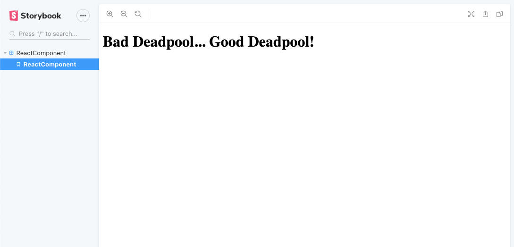

[](https://github.com/Paraboly/react-icon-button)

[](https://www.npmjs.com/package/@paraboly/react-icon-button)
[](https://www.npmjs.com/package/@paraboly/react-icon-button)

[](https://opensource.org/licenses/MIT)
[](https://github.com/prettier/prettier)

<p align="center">
  
</p>

# Install

```sh
npm i @paraboly/react-icon-button
```

# Usage

Please check the storybook's example to get the usage of the library.
You can simply clone the project and `npm i && npm start` to check the how to use the library with alive example.

```js
import IconButton from "@paraboly/react-icon-button";

<IconButton text="Filter" imageSource={filterIcon} />;
```

### Configuration - Props

| Property           |   Type   |          Default          | Description                                                      |
| ------------------ | :------: | :-----------------------: | ---------------------------------------------------------------- |
| imageSource        |  image   |         undefined         | use this to set your own image                                   |
| onPress            | function |           null            | set the onPress function                                         |
| text               |  string  |           null            | use this to change the text                                      |
| textDisable        | boolean  |           false           | use this to disable the text part if you do not want to use text |
| hoverColor         |  color   | rgba(255, 255, 255, 0.08) | change button's hovered background color                         |
| iconStyle          |  style   |          default          | set your own style for the icon (image)                          |
| textStyle          |  style   |          default          | set your own style for the text                                  |
| textContainerStyle |  style   |          default          | set your own style for the text's container                      |
| buttonStyle        |  style   |          default          | set your own style for the button itself                         |
| iconAlt            |  string  |         undefined         | set your own alt naming for the icon (image)                     |

## Credits

Thank you so much for the filter icon [Flaticon](https://www.flaticon.com/free-icon/filter_872173?term=filter&page=1&position=95)

## Author

FreakyCoder, kurayogun@gmail.com

## License

React Icon Button is available under the MIT license. See the LICENSE file for more info.
